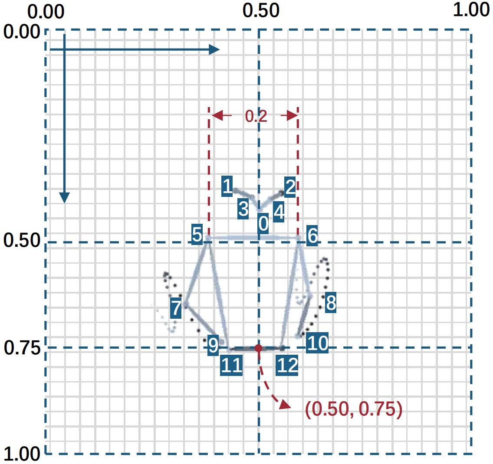

# 首届国际“远见杯”元智能数据挑战大赛——动作认知赛道比赛数据

🔗 [**赛题说明**](./assets/赛题说明.pdf) | [**比赛官网**](http://prospective.tocenet.org/) | [**CENet\'22**](https://www.tocenet.org/)

近年来，人工智能已经成功地对多种人类艺术进行建模与学习。深度学习算法已经能生成包括诗歌艺术、绘画艺术、音乐艺术、舞蹈艺术在内的多种人类艺术形式。本赛题关注音乐驱动的指挥动作生成这一任务，以音乐为输入信号，生成对应的指挥动作。

模型需要以采样率为90Hz的音乐音频梅尔频谱图作为输入，输出与之对应的指挥动作上半身13个关键点的30Hz二维坐标序列。生成的动作应自然，美观，与音乐节奏同步且语义相关。同时，要求模型适应不同的音乐节奏，并适应包括交响乐、流行音乐、摇滚音乐等不同的音乐风格。


## 🔔 News 

**2022-07-05** 英文模型设计报告模板同大会会议论文模板，可在 [此处](https://www.tocenet.org/?attachment_id=17608&download=1。) 下载。

**2022-07-03** [测试集](https://pan.baidu.com/s/18ecHYk9b4YM5YTcBNn37qQ?pwd=3209 ) 与 [歌曲列表](./assets/歌曲列表.md) 现已公开，请按照 [赛题说明](./assets/赛题说明.pdf) 中的要求，于2022年7月7日12:00前提交参赛作品。

**2022-03-21** [第十二届计算机工程与网络国际会议（CENet2022）暨首届国际“远见杯”元智能数据挑战大赛通知](https://www.jscs.org.cn/x1.php?id=770)

**2022-03-21** [首届国际“远见杯”元智能数据挑战大赛通知](https://www.jscs.org.cn/x1.php?id=770)

## 🎶 ConductorMotion100 数据集 

- 训练集：https://pan.baidu.com/s/1Pmtr7V7-9ChJqQp04NOyZg?pwd=3209
- 验证集：https://pan.baidu.com/s/1B5JrZnFCFvI9ABkuJeWoFQ?pwd=3209 
- 测试集：https://pan.baidu.com/s/18ecHYk9b4YM5YTcBNn37qQ?pwd=3209 

You can also access the dataset via [**Google Drive**](https://drive.google.com/drive/folders/1I2eFM-vEbqVXtD4sUPmGFSeNZeu_5JMu?usp=sharing)

ConductorMotion100 数据集包含训练集、验证集与测试集，时长分别为90/5/5小时。将压缩文件解压至 `<Your Dataset Dir>` 后，得到的文件结构将会是：

```
tree <Your Dataset Dir>
<Your Dataset Dir>
    ├───train
    │   ├───0
    │   │       mel.npy
    │   │       motion.npy
    |  ...
    │   └───5268
    │           mel.npy
    │           motion.npy
    └───val
        ├───0
        │       mel.npy
        │       motion.npy
       ...
        └───290
                mel.npy
                motion.npy
```

每一个  `mel.npy` 和 `motion.npy` 文件对应着 <u>60秒</u> 的音频频谱图与指挥动作数据，两者的采样率分别为 <u>90 Hz</u> 和 <u>30 Hz</u>。梅尔频谱图有 128 个频段，因此  `mel.shape = (5400, 128)`。指挥动作数据为上半身13个关键点的2维坐标，因此 `motion.shape = (1800, 13, 2)`。动作关键点的具体格式如下：



我们提供加载 ConductorMotion100 数据集的代码，它位于 `utils/dataset.py`。你可以运行下面的命令来进行数据可视化：

```bash
python utils/dataset.py --dataset_dir <Your Dataset Dir>
```

这个脚本会遍历数据集中的每一个样本并进行可视化，你将会得到：


## ✍ 评分标准 
比赛最终得分由初赛预测评测指标、报告及演示视频得分、答辩现场表现得分三部分构成，上述三部分得分占比分别为40%、30%、30%。参赛队伍提交的模型将在测试集上通过节奏密度误差、力度轮廓误差、动作标准差百分比、算法耗时这4种评价指标进行性能评测：

- 节奏密度误差（Rhythm Density Error，RDE）：计算真实动作与生成动作每一个关键点的功率谱密度，对比得到结果中大于0.7 Hz的部分，以分析生成动作的节奏是否正确。 


- 力度轮廓误差（Strength Contour Error，SCE）：计算真实动作与生成动作的一阶差分后降采样，将不同关键点的结果相加，得到两条力度轮廓。对比力度轮廓的差异，分析生成动作的力度是否正确。 


- 动作标准差百分比（Standard Deviation Percentage，SDP）：分别计算真实指挥动作与生成动作的标准差,以之比来分析生成动作的幅值与真实动作的接近程度。


- 模型生成单位时长的指挥动作所需的时间。

RDE、SCE、SDP 的具体定义见 [评价指标定义.pdf](./assets/评价指标定义.pdf)


## 🚀 基线模型 

本赛题提供用于数据集加载、训练、评测、可视化的 pytorch 代码。本代码实现了一个输出为常量的 ``plain model``。
此外，我们还给出基于 CNN-LSTM 的基线模型（`CNN-LSTM baseline`）在验证集上的评价指标。该模型使用4个卷积层从梅尔频谱图中提取特征，输入2层LSTM生成指挥动作，使用MSE损失函数进行训练。
使用1张 NVIDIA V100 GPU，以 `1e-3` 为学习率，64 为 batch size 在训练集上训练 100 epoch 耗时约5小时。

| Model             | RDE    | SCE    | SDP    |
|-------------------|--------|--------|--------|
| `plain model`       | 1.2368 | 3.6436 | 0.00% |
| `CNN-LSTM baseline` | 1.0491 | 2.7472 | 43.63% |


- 克隆代码

    ```bash
    git clone https://github.com/ChenDelong1999/VirtualConductor.git
    cd VirtualConductor
    ```

- 创建 Anaconda 虚拟环境

    ```bash
    conda create -n VirtualConductor python=3.6 -y
    conda activate VirtualConductor
    ```

- 确保 CUDA Toolkit, cudnn, pytorch 已安装
    ```bash
    conda install pytorch torchvision torchaudio cudatoolkit=11.3 -c pytorch -y
    # see: https://pytorch.org/get-started/locally/
    ```

- 安装其它依赖

    ```bash
    conda install ffmpeg -c conda-forge -y
    pip install librosa matplotlib scipy tqdm moviepy opencv-python tensorboard
    ```
- 训练模型

    ```bash
    python train.py --dataset_dir <Your Dataset Dir>
    ``` 
    训练过程中，运行 `tensorboard --logdir runs` 来监控训练过程。模型的权重将保存在 `runs/<Your Experiment Log Dir>/checkpoints` 文件夹。


- 可视化生成结果 
    
    将音频文件复制到 `/test/test_samples/` 文件夹，运行下面的命令
    
    ```bash
    python test_unseen.py --model 'runs/<Your Experiment Log Dir>/checkpoints/checkpoint_latest.pt'
    ```

    `test_unseen.py` 将会：
  1. 遍历 `/test/test_samples/` 下所有的音频文件, 
  2. 提取梅尔频谱图, 生成指挥动作，
  3. 将结果以 `.mp4` 文件的格式保存至 `/test/result/`


## 🎈 引用 

请在您的出版物中引用以下文章：
```bibtex
@article{chen2021virtualconductor,
    author    = {Delong Chen and
                Fan Liu and
                Zewen Li and
                Feng Xu},
    title     = {VirtualConductor: Music-driven Conducting Video Generation System},
    journal   = {CoRR},
    volume    = {abs/2108.04350},
    year      = {2021},
    url       = {https://arxiv.org/abs/2108.04350},
    eprinttype = {arXiv},
    eprint    = {2108.04350}
}
```

```bibtex
@article{jcst2022self,
  author    = {Fan Liu and
               Delong Chen and
               Ruizhi Zhou and
               Sai Yang and
               Feng Xu},
  title     = {Self-Supervised Music Motion Synchronization Learning for Music-Driven
               Conducting Motion Generation},
  journal   = {Journal of Computer Science and Technology},
  volume    = {37},
  number    = {3},
  pages     = {539--558},
  year      = {2022},
  doi       = {10.1007/s11390-022-2030-z},
}
```

```bibtex
@article{li2021survey,
  title={A survey of convolutional neural networks: analysis, applications, and prospects},
  author={Li, Zewen and Liu, Fan and Yang, Wenjie and Peng, Shouheng and Zhou, Jun},
  journal={IEEE Transactions on Neural Networks and Learning Systems},
  year={2021},
  publisher={IEEE}
}

```