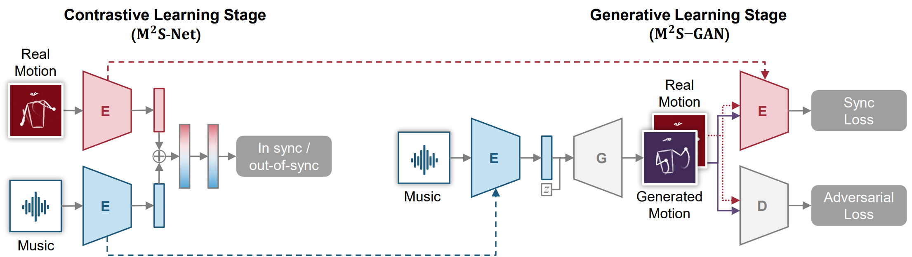
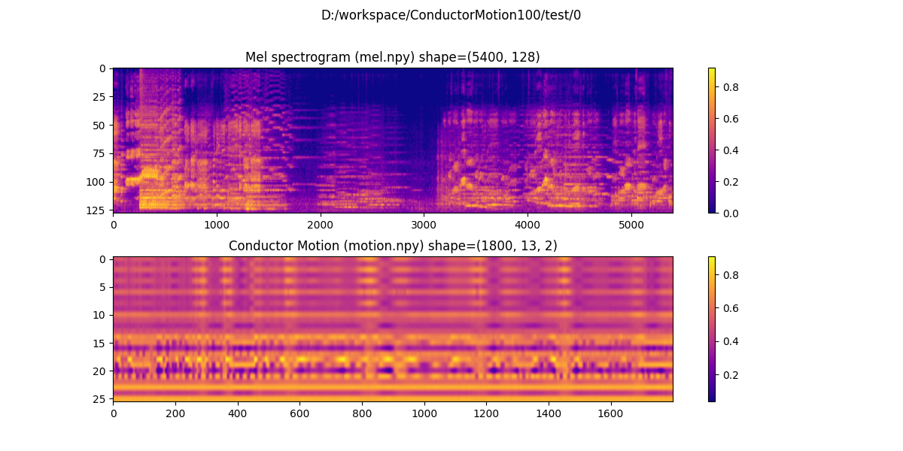
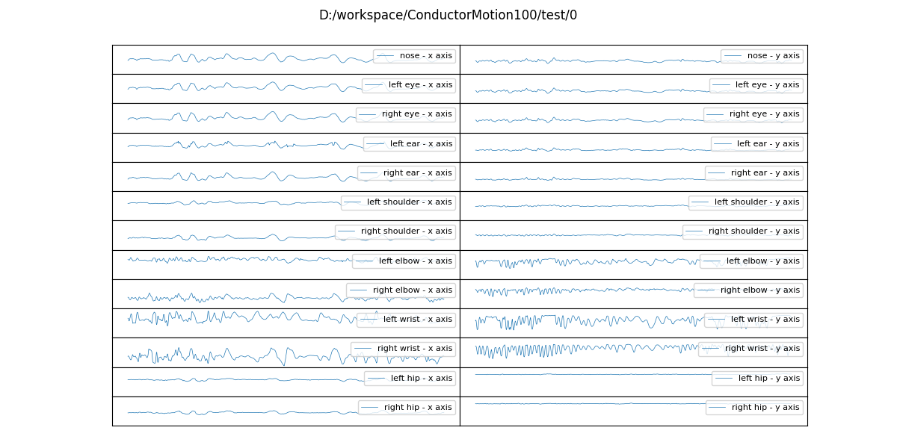
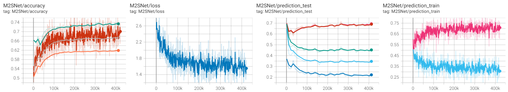
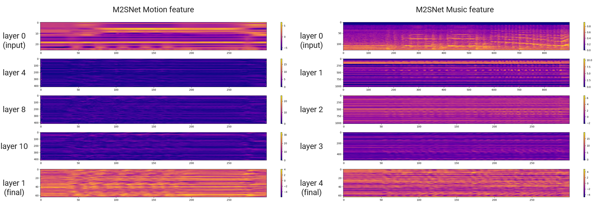
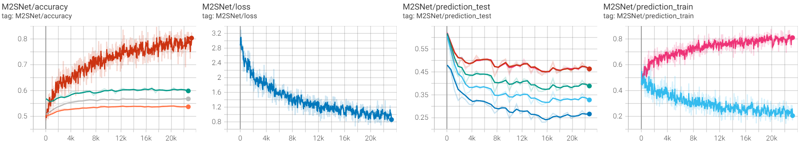
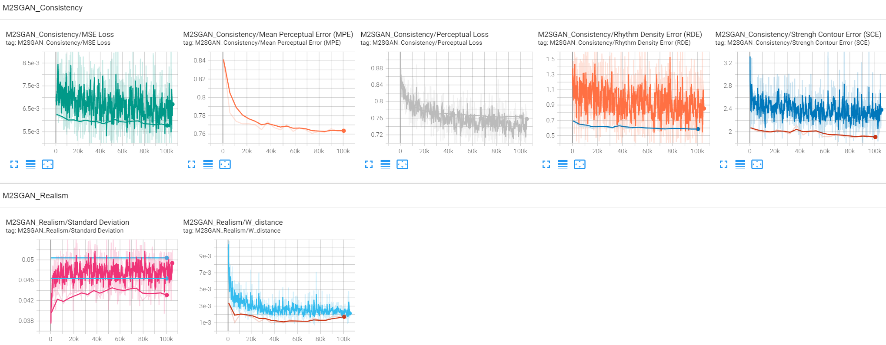

# VirtualConductor
## Introduction

This repository is the official implementation of 
*“**Self-Supervised Music-Motion Synchronization Learning for Music-Driven Conducting Motion Generation**”*, 
by 
[Fan Liu](https://cies.hhu.edu.cn/_s97/2013/0508/c4122a54931/page.psp), 
[Delong Chen](https://github.com/chenDelong1999), 
[Ruizhi Zhou](https://github.com/ZhouRuiZhi), 
Sai Yang, and Feng Xu. 
This repository also provide the access to the ***ConductorMotion100*** dataset, which consists of 100 hours of orchestral conductor motions and aligned music (Mel spectrogram).

We proposed the first deep learning based conducting motion generation approach. This figure gives a high-level illustration of the proposed two-stage approach. The contrastive learning and generative learning stage are bridged by transferring learned music and motion encoders, as noted in dotted lines. Our approach can generate plausible, diverse, and music-synchronized conducting motion.



**Updates**🔔

- Mar 2021. [Demo Video (preliminary version)](https://www.bilibili.com/video/BV1pB4y1P7oh) released.
- Apr 2021. [ICME 2021 Demo Video](https://www.bilibili.com/video/BV1aX4y1g7wh) released.
- Apr 2021. [Demo Video (with Dynamic Frequency Domain Decomposition)](https://www.bilibili.com/video/BV1Zy4y1W7Qq) released.
- Jun 2021. [recording of graduation thesis defense](https://www.bilibili.com/video/BV1yK4y137Xk) released. The graduation thesis is awarded as Outstanding Graduation Thesis of Hohai University, and is currently selected as a candidate for Outstanding Graduation Thesis of Jiangsu Province!
- Jul 2021. The _VirtualConductor_ project is awarded as [BEST DEMO](http://2021.ieeeicme.org/2021.ieeeicme.org/best_demo_awards.html) of IEEE International Conference on Multimedia and Expo (ICME) 2021!
- Jan 2022. Code is released. _ConductorMotion100_ dataset will be released after our journal paper acceptance.

**Associated Papers**

1. Delong Chen, Fan Liu*, Zewen Li, Feng Xu. [VirtualConductor: Music-driven Conducting Video Generation System](https://arxiv.org/abs/2108.04350). _IEEE International Conference on Multimedia and Expo (ICME) 2021, [Demo Track](http://2021.ieeeicme.org/2021.ieeeicme.org/best_demo_awards.html)._
   
    Please cite the corresponding arXiv version as:

    ```
    @article{chen2021virtualconductor,
      author    = {Delong Chen and
                   Fan Liu and
                   Zewen Li and
                   Feng Xu},
      title     = {VirtualConductor: Music-driven Conducting Video Generation System},
      journal   = {CoRR},
      volume    = {abs/2108.04350},
      year      = {2021},
      url       = {https://arxiv.org/abs/2108.04350},
      eprinttype = {arXiv},
      eprint    = {2108.04350}
    }
    ```
2. Fan Liu, Delong Chen*, Ruizhi Zhou, Sai Yang, and Feng Xu. Self-Supervised Music-Motion Synchronization Learning for Music-Driven Conducting Motion Generation. _under review_.

## Get Started

### Install

- Clone this repo:

    ```bash
    git clone https://github.com/ChenDelong1999/VirtualConductor.git
    cd VirtualConductor
    ```

- Create a conda virtual environment and activate it:

    ```bash
    conda create -n VirtualConductor python=3.6 -y
    conda activate VirtualConductor
    ```

- Install `CUDA Toolkit 11.3` ([link](https://developer.nvidia.com/cuda-11.3.0-download-archive)) and `cudnn==8.2.1` [(link)](https://developer.nvidia.com/rdp/cudnn-archive), then install `PyTorch==1.10.1`:

    ```bash
    conda install pytorch torchvision torchaudio cudatoolkit=11.3 -c pytorch -y
    # if you prefer other cuda versions, please choose suitable pytorch versions
    # see: https://pytorch.org/get-started/locally/
    ```

- Install other requirements:

    ```bash
    conda install ffmpeg -c conda-forge -y
    pip install librosa matplotlib scipy tqdm moviepy opencv-python tensorboard
    ```

### Test on Your Own Music 🎶

- Copy your music file to `/test/test_samples/` folder. We have prepared some for you. 
- You need the pretrained weights of a  M<sup>2</sup>S-GAN to generate motions. We have prepared a pretrained checkpoint, which is placed at `checkpoints/M2SGAN/M2SGAN_official_pretrained.pt`. 
- Now, by run the following comment, the `test_unseen.py` will do the following:
  1. enumerate all samples in `/test/test_samples/` folder, 
  2. extract Mel spectrogram from music, 
  3. generate conducting motions, and 
  4. save result videos to `/test/result/`

      ```bash
      python test_unseen.py --model 'checkpoints/M2SGAN/M2SGAN_official_pretrained.pt'
      ```

### Data Preparation (*ConductorMotion100*)

The ConductorMotion100 dataset can be downloaded in the following ways:

- [~~Baidu Pan~~]()
- Dataset will be ready after paper acceptance!

There are 3 splits of *ConductorMotion100*: train, val, and test. They respectively correspond to 3 `.rar` files. After extract them to `<Your Dataset Dir>` folder, the file structure will be:

```
tree <Your Dataset Dir>
<Your Dataset Dir>
    ├───train
    │   ├───0
    │   │       mel.npy
    │   │       motion.npy
    |  ...
    │   └───5268
    │           mel.npy
    │           motion.npy
    ├───val
    │   ├───0
    │   │       mel.npy
    │   │       motion.npy
    |  ...
    │   └───290
    │           mel.npy
    │           motion.npy
    └───test
        ├───0
        │       mel.npy
        │       motion.npy
       ...
        └───293
                mel.npy
                motion.npy
```

Each `mel.npy` and `motion.npy` are corresponded to <u>60 seconds</u> of Mel spectrogram and motion data. Their sampling rates are respectively <u>90 Hz</u> and <u>30 Hz</u>. The Mel spectrogram has 128 frequency bins, therefore `mel.shape = (5400, 128)`. The motion data contains 13 2d keypoints, therefore `motion.shape = (1800, 13, 2)`

We provide codes to load and visualize the dataset, as in `utils/dataset.py`. You can run this file by:

```bash
python utils/dataset.py --dataset_dir <Your Dataset Dir>
```

Then the script will enumerate all the samples in the dataset. You will get:





## Training

During training, use `tensorboard --logdir runs` to set up tensorboard logging. Model checkpoints will be saved to `/checkpoints/` folder.

### Step 1

- Start contrastive learning stage, train the M<sup>2</sup>S-Net:

    ```bash
    python M2SNet_train.py --dataset_dir <Your Dataset Dir>
    ```

    It takes ~36 hours with a Titan Xp GPU. With tensorboard (`tensorboard --logdir runs`), you can visualize the training procedure:

    

    We also provide the visualization of the features extracted by M<sup>2</sup>S-Net
    
    
    <!-- Easy: 0.73337 | Hard: 0.67346 | Super-hard: 0.62021 -->

### Step 2 (optional)
- Train a M2S-Net on test set to calculate the 'sync error' (see our paper for more details):

  ```bash
  python M2SNet_train.py --dataset_dir <Your Dataset Dir> --mode hard_test
  ```
  The training takes ~2.5 hours.
  
  
  <!-- Easy: 0.59187 | Hard: 0.56757 | Super-hard: 0.53661 -->

### Step 3
- Start generative learning stage, train the M<sup>2</sup>S-GAN:

   ```bash
   python M2SGAN_train.py --dataset_dir <Your Dataset Dir>
   ```
  The training takes ~28 hours with a Titan Xp GPU.
  
  
  <!-- MPE: 0.76339 | RDE: 0.58609 | SCE: 1.88849 -->

### Prospective Cup

["Prospective Cup"]: ProspectiveCup/README.md


### License

Copyright (c) 2022 Delong Chen. Contact me for commercial use (or rather any use that is not academic research) (email: chendelong@hhu.edu.cn). Free for research use, as long as proper attribution is given and this copyright notice is retained.